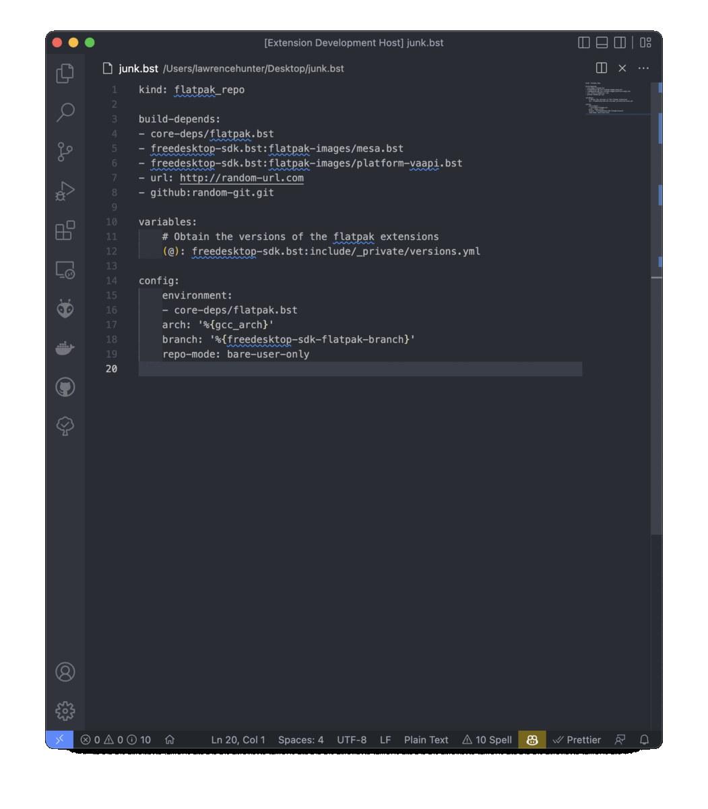

# vsc-buildstream-extension

This is a Visual Studio Code extension that enables syntax highlighting for [buildstream](https://buildstream.build). 

## Features

## Install
To start using the extension with Visual Studio Code copy it into the `<user home>/.vscode/extensions` folder and restart Code.